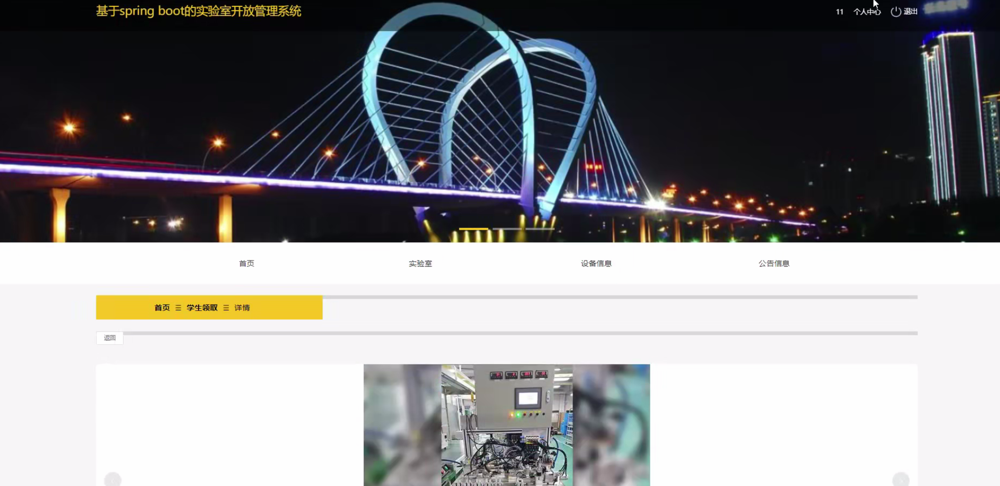

# 基于SpringBoot+Vue的实验室开放管理系统设计与实现

#### 介绍
基于SpringBoot+Vue的实验室开放管理系统设计与实现；附有完整源码➕数据库➕文档等。

本项目可以用于毕业设计，白嫖勿扰！
全网毕业设计项目这里都有

#### 课题背景
随着科研和教育事业的不断发展，实验室作为重要的科研和教学场所，承载着大量的实验和学术活动。随着实验室规模的扩大，实验室资源（如设备、场地、人员等）的管理变得愈加复杂，传统的人工管理方式已无法满足日益增长的需求。尤其是在实验室的开放使用、设备借用、预约管理和资源调度等方面，传统方法不仅效率低下，还容易出现信息不对称、资源浪费和管理混乱等问题。

因此，设计和实现一个基于SpringBoot+Vue的实验室开放管理系统显得尤为重要。SpringBoot作为一种轻量级的Java开发框架，具有快速开发、高效集成和良好的扩展性，能够为实验室管理提供稳定、可靠的后端支持；而Vue.js则是一款流行的前端框架，具有响应式界面、灵活的组件化设计和良好的用户体验，能够为系统提供现代化的前端展示和交互功能。通过结合这两种技术，可以实现实验室资源的数字化、自动化管理，提高管理效率，减少人为错误，并为实验室的开放、预约和资源共享提供更加科学和高效的解决方案。

该系统的实现将有效解决实验室资源分配不均、管理不规范、信息滞后等问题，提升实验室的使用效率，同时增强科研人员和学生的使用体验。通过合理的数据管理与智能化的资源调度，实验室开放管理系统不仅能够提高实验室管理的透明度，还能促进资源的共享与利用，推动科研和教学活动的顺利进行。
#### 获取源码
V：13283346760

Q：985089028

注意：添加时备注项目名称

#### 软件架构
开发环境：JDK8、SpringBoot、Maven、MySQL、Vue

#### 安装教程

1.  下载IDEA集成开发工具
2.  配置Maven环境
3.  启动项目

#### 项目运行截图

